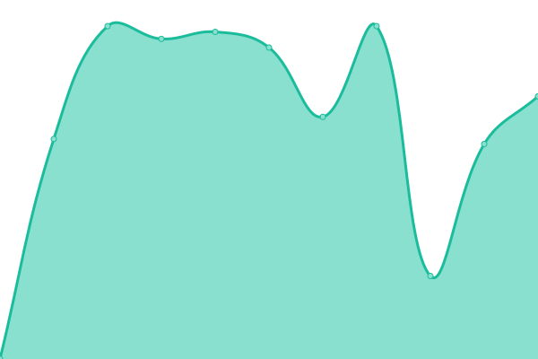

# [📈 Live Status](https://demo.upptime.js.org): <!--live status--> **🟩 All systems operational**

This repository contains the open-source uptime monitor and status page for [Visidea](https://visidea.ai), powered by [Upptime](https://github.com/upptime/upptime).

With [Upptime](https://upptime.js.org), you can get your own unlimited and free uptime monitor and status page, powered entirely by a GitHub repository. We use [Issues](https://github.com/visidea/uptime/issues) as incident reports, [Actions](https://github.com/visidea/uptime/actions) as uptime monitors, and [Pages](https://demo.upptime.js.org) for the status page.

<!--start: status pages-->
<!-- This summary is generated by Upptime (https://github.com/upptime/upptime) -->
<!-- Do not edit this manually, your changes will be overwritten -->
<!-- prettier-ignore -->
| URL | Status | History | Response Time | Uptime |
| --- | ------ | ------- | ------------- | ------ |
|  [Visidea website](https://visidea.ai) | 🟩 Up | [visidea-website.yml](https://github.com/visidea/uptime/commits/HEAD/history/visidea-website.yml) | 

 1941ms
     
 | 

<a href="https://status.visidea.ai/history/visidea-website">100.00%</a>
    

|  [Visidea APIs](https://api.visidea.ai/api/health) | 🟩 Up | [visidea-ap-is.yml](https://github.com/visidea/uptime/commits/HEAD/history/visidea-ap-is.yml) | 

 370ms
     
 | 

<a href="https://status.visidea.ai/history/visidea-ap-is">100.00%</a>
    

|  [Visidea dashboard](https://app.visidea.ai/) | 🟩 Up | [visidea-dashboard.yml](https://github.com/visidea/uptime/commits/HEAD/history/visidea-dashboard.yml) | 

 432ms
     
 | 

<a href="https://status.visidea.ai/history/visidea-dashboard">99.87%</a>
    

<!--end: status pages-->

[**Visit our status website →**](https://demo.upptime.js.org)

## 📄 License

- Powered by: [Upptime](https://github.com/upptime/upptime)
- Code: [MIT](./LICENSE) © [Anand Chowdhary](https://anandchowdhary.com), supported by [Pabio](https://pabio.com)
- Data in the `./history` directory: [Open Database License](https://opendatacommons.org/licenses/odbl/1-0/)
